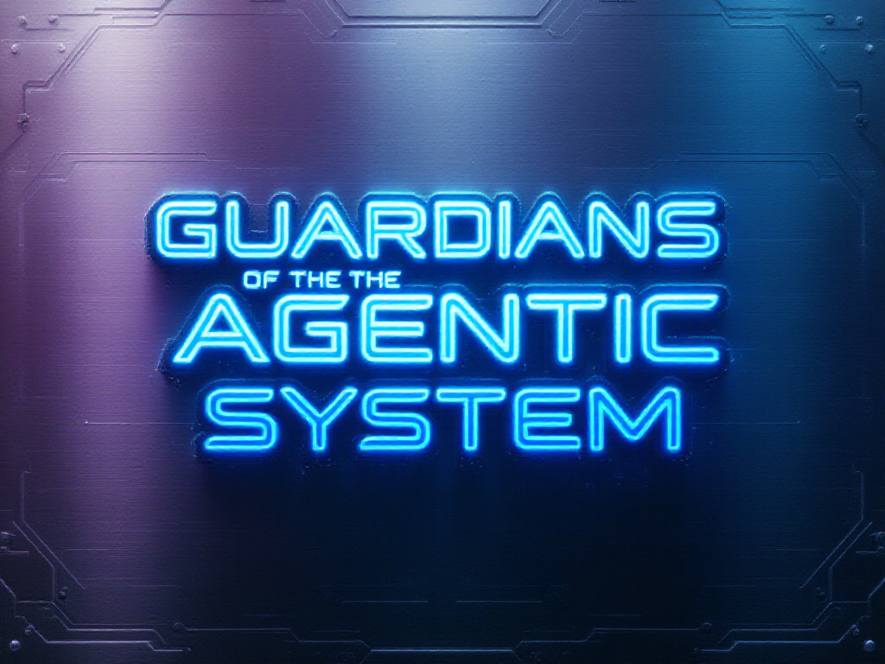

<h1 align="center">
  <a href="https://github.com/GitsSaikat/Guardians-Preventing-Jail-Break-Prompts">
    </a><br>
    <h1>Guardians of the Agentic System: Preventing Many Shots Jailbreak with Agentic System 🛡️</h1>
    <h2>Improving AI Systems with Self-Defense Mechanisms 🤖</h2>
</h1>

<p align="center">
  📚 <a href="https://github.com/GitsSaikat/Guardians-Preventing-Jail-Break-Prompts">[GitHub Repository]</a> |
  📝 <a href="https://arxiv.org/abs/2502.16750">[Paper]</a>
</p>


We have experimented and developed a defensive system for AI agents to protect themselves against adversarial prompt attacks and jailbreak attempts.

## Overview

This repository implements self-defending mechanisms for AI systems, enabling them to:
- Detect and prevent prompt injection attacks
- Maintain operational boundaries
- Filter malicious instructions
- Preserve their core directives
- Self-validate responses

## Core Components

- Automated prompt threat detection
- Self-validation mechanisms
- Response integrity checks
- Boundary enforcement
- Defensive prompt patterns

## Usage

The system actively monitors and defends against attempts to:
- Override core instructions
- Bypass safety measures
- Manipulate system behavior
- Inject malicious prompts

For implementation details, check the examples in `/experiments` directory.

## Note

⚠️ **Important**: Due to safety and security considerations, not all components of this codebase are publicly available. The published code represents a subset of our implementation that demonstrates the core concepts while avoiding potential misuse. Some security-critical components and specific implementation details have been intentionally withheld to prevent exploitation of the system.

## License

This project is licensed under the MIT License. See the [LICENSE](LICENSE) file for details.

## Citations

If you use this work in your research, please cite:

```bibtex
@article{barua2025guardians,
  title={Guardians of the Agentic System: Preventing Many Shots Jailbreak with Agentic System},
  author={Barua, Saikat and Rahman, Mostafizur and Sadek, Md Jafor and Islam, Rafiul and Khaled, Shehnaz and Kabir, Ahmedul},
  journal={arXiv preprint arXiv:2502.16750},
  year={2025}
}
```

## Acknowledgments

This research builds upon work in adversarial robustness and AI safety. Special thanks to:
- Contributors and researchers in the AI safety community
- Open-source AI/ML security projects